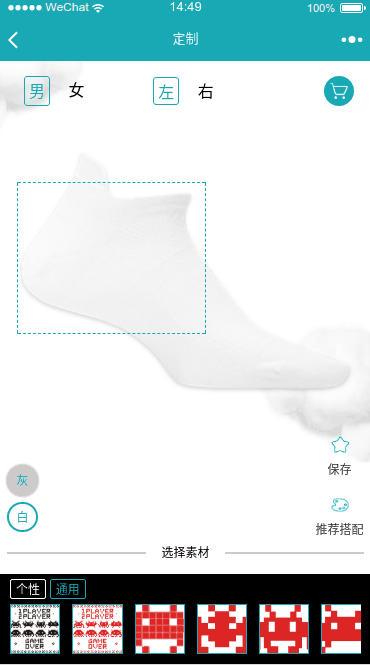

### 前言
最近在捣腾一个 `袜子图案在线定制` 的小程序,核心的需求大概是选择一只纯色的袜子,然后客户可以在袜子上面添加图案,
最终生成一个设计图保存后服务器。定制的图案可以旋转,缩放和拖动,当然,还可以删除。

> 内容比较初级, 因为我也只是一个 canvas 新手,本文仅是一次实践的记录.



### 实现-绘图
其实刚开始接手这个项目的时候,我是打算用小程序的 web-view 组件来嵌套 h5 的,
因为小程序的 canvas 的坑,或者说小程序的坑,我是深有体会的,不过回过头来想,
web-view 我还没再项目中用过, 还说不定会遇到什么更大的坑呢,所以最终还是选择小程序的 canvas

首先, 计算图片的大小和位置,不能让图片超过画布(我这里是不能超过画布的 80%),位置在画布的正中间.

然后, 需要将原点移动到**画布的中心点** 这点比较重要,等下下面的旋转如果没有这一步的话,会沿着图片的左上角旋转.

第三步,将目标图像画到画板上,找个是没啥难的,直接调用 `ctx.drawImage` 既可

```
if (!this.imgUrl) return
ctx.drawImage(this.imgUrl, x, y, this.tempImgWidth, this.tempImgHeight)
```

drawImage 之前需要 判断一下目标图像的路径是否可以拿到图片,如果图片路径有问题,会直接报错,并且影响接下来的代码执行,
相当于整个应用崩溃了.

我这里因为都是本地图片,所以只要判断图片存不存在即可,如果是网络图片,还要先保存成本地图片再 drawImage,
不然有可能会出现很多画不出来的可能性.

由于中心点已经偏移了,这个时候, drawImage 的 x 和 y 需要向左上角偏移回去(imgWidth / -2, imgHeight / -2),
保持图片的中心点跟canvas的原点重叠.

到此, 图片就画好了,如果有旋转,要在这个时候旋转.旋转完以后,再画外框和操作按钮,
这样可以保持外框和操作按钮不随着图片旋转(经过验证,这种方式比跟着旋转的好很多),
旋转也很简单,直接调用 `ctx.rotate` 即可, 旋转的角度计算方法百度上有.我是直接拷贝的


然后就是操作按钮和虚线框,参数跟 drawImage 一样,因为是画一个跟图片一样大小的框框嘛..

虚线框
```
ctx.setStrokeStyle('#fd749c')
ctx.setLineDash([5, 5], 10);
ctx.strokeRect(x, y, this.tempImgWidth, this.tempImgHeight)
```

操作按钮,这里的 r 是按钮的半径, d 是按钮的直径,无非就是在图片的四个角,画按钮.
```
// 画 删除 按钮
ctx.drawImage('/static/design/icons/delete.png', x - r, y - r, d, d)
// 画 旋转 按钮
ctx.drawImage('/static/design/icons/rotate.png', x + this.tempImgWidth - r, y - r, d, d)
// 画 缩放 按钮
ctx.drawImage('/static/design/icons/scale.png', x + this.tempImgWidth - r, y + this.tempImgHeight - r, d, d)
```

最后再调用一下 `ctx.draw()` 完成绘图. 所用到的 API 都很简单,不过过程要计算的东西还是很多

### 实现-操作

绘图已经完成了,那么如何做到点击或拖动操作按钮,做响应的操作呢?
这就需要监听 canvas 的 bindtouchstart, bindtouchmove, bindtouchend 三个事件,
然后 ` e.touches[0].x` 和 `e.touches[0].y` 可以获取当前手指的位置,
在 bindtouchstart 的回调里面判断当前位置,如果跟某个操作按钮重叠,就说明是操做,如果都没有重叠,则是拖动,然后把操作记录下来,
在 bindtouchmove 的回调里面,获取手指移动的距离和角度,然后根据 bindtouchstart 里记录的操作,
调整对应的参数(拖动跟缩放,只要计算当前点的 x,y 跟 bindtouchstart 点的 x,y 的偏移量即可,旋转的上面有提过,百度有),
然后重新调用 `ctx.draw()` 重新绘图.

一个操作做完,可能需要复位一些东西,这个可以在 bindtouchend 的回调里面去做

> tips: 这里的 `e.touches[0].x` 的 e 是回调函数带的参数


### 保存定制图

这些都画好以后,需要把定制图保存起来,指定图保存的不单单是原来那个 canvas里的图,还要连底图(也就是那张袜子图)一起保存起来,
需要一个袜子图那么大的 canvas(这个称为临时 canvas 吧),先把袜子画进去,然后再把图案画上去,画图案上去的时候,由于画布大小位置已经变了,
所以需要稍微计算一下,大概就是 x,y 要分别加上原来的 canvan 跟袜子图左上角的距离.然后还要把外框跟操作按钮去掉.
最后调用 `ctx.draw` 把图画出来..这里有点需要注意的是,draw 其实是个异步函数,如果你在`ctx.draw()` 下一行做保存操作,
那么你保存的会是一个空白的图片,draw 函数的第二个参数,是一个回调函数,想要获取画完图的 canvas,要在这个回调函数里面才能拿的到

```
ctx.draw(false, function () {
    // 要先保存到临时路径
    wx.canvasToTempFilePath({
      canvasId: 'tempCanvas',
      success: function (res) {
        // 然后再保存到相册
        wx.saveImageToPhotosAlbum({
          filePath: res.tempFilePath,
          success () {
            wx.showToast({
              title: '保存成功!',
              icon: 'none',
              duration: 2000
            })
          }
        })
      }
    })
  }
)
```

你感受到了微信小程序团队满满的恶意了吗? 这大概是我第一次写这么深的嵌套吧..传说中的回调地狱.虽然可以用 promise 封装解决,
不过为了几个几乎不会复用的 API 去封装似乎不太划算. 不过总算还是保存成功了.

> tips: 为了保存的时候这个临时 canvas 不影响正常界面,这我的做法是对 临时 canvas 设置 position:fixed; left:100vw;这两个样式,把它隐藏起来

### 最后

本文用的代码都是基于 mpvue 框架的, 这个也是个比较基础的东西,就不整个项目开源浪费 github 的空间了,
我把跟 canvas 有关代码上传到[这里](https://github.com/noahlam/practice-truth/blob/master/code/OnlineDesign.vue),
仅供参考,单独运行是肯定运行不起来, 如果有需要源码,可以私下发邮件找我要.