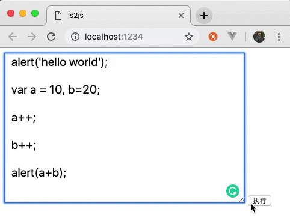

## 手摸手教你用 js 写一个 js 解释器

用 js 来 `编译 js` 看起来是个高大上的东西，实际原理其实很简单，无非就是利用 js `对象属性可以用字符串表示` 这个特性来实现的黑魔法罢了。
之所以看起来那么 `深奥`, 大概是由于网上现有的教程，都是动不动就先来个 `babylon / @babel/parser` 先让大家看个一大串的 `AST`, 然后再贴出一大串的代码,
直接递归 AST 处理所有类型的节点. 最后成功的把我这样的新手就被吓跑了。

那么今天我写这篇的目的，就是给大家一个浅显易懂，连刚学 js 的人都能看懂的 js2js 教程。

先来看一下效果




### 一个最简单的解释器

上面有提到，js 有个特性是 `对象属性可以用字符串表示`，如 console.log 等价于 console['log'], 辣么根据这个特性，我们可以写出一个兼容性极差，极其简陋的雏形

```javascript

  function callFunction(fun, arg) {

    this[fun](arg);

  }

  callFunction('alert', 'hello world');

  // 如果你是在浏览器环境的话，应该会弹出一个弹窗

```

既然是简易版的，肯定是问题一大堆，js 里面得语法不仅仅是函数调用，我们看看赋值是如何用黑魔法实现的

```javascript

  function declareVarible(key, value) {

    this[key] = value;

  }

  declareVarible.call(window, 'foo', 'bar');

  // window.foo = 'bar'

```
> Tips: const 可以利用 Object.defineProperty 实现;

如果上面的代码能看懂，说明你已经懂得了 `js 解释器` 的基本原理了，看不懂那只好怪我咯。

### 稍微加强一下

可以看出，上面为了方便, 我们把函数调用写成了 `callFunction('alert', 'hello world');` 但是着看起来一点都不像是 `js 解释器`,
我们心里想要的解释器至少应该是长这样的 `parse('alert("hello world")'')`, 那么我们来稍微改造一下, 在这里我们要引入 babel 了,
不过先不用担心, 我们解析出来的语法树(AST)也是很简单的。

```javascript
import babelParser from '@babel/parser';

const code = 'alert("hello world!")';

const ast = babelParser.parse(code);
```

以上代码, 解析出如下内容

```javascript
{
  "type": "Program",
  "start": 0,
  "end": 21,
  "body": [
    {
      "type": "ExpressionStatement",
      "start": 0,
      "end": 21,
      "expression": {
        "type": "CallExpression",
        "start": 0,
        "end": 21,
        "callee": {
          "type": "Identifier",
          "start": 0,
          "end": 5,
          "name": "alert"
        },
        "arguments": [
          {
            "type": "Literal",
            "start": 6,
            "end": 20,
            "value": "hello world!",
            "raw": "\"hello world!\""
          }
        ]
      }
    }
  ],
  "sourceType": "module"
}
```

上面的内容看起来很多，但是我们实际有用到到其实只是很小的一部分, 来稍微简化一下, 把暂时用不到的字段先去掉

```javascript
{
  "type": "Program",
  "body": [
    {
      "type": "ExpressionStatement",
      "expression": {
        "type": "CallExpression",
        "callee": {
          "type": "Identifier",
          "name": "alert"
        },
        "arguments": [
          {
            "type": "Literal",
            "value": "hello world!",
          }
        ]
      }
    }
  ],
}
```

我们先大概浏览一遍 AST 里面的所有属性名为 `type` 的数据


1. ExpressionStatement
1. CallExpression
1. Identifier
1. Literal


一共有 4 种类型, 那么接下来我们把这 4 种节点分别解析, 从最简单的开始

#### Literal
```javascript
{
    "type": "Literal",
    "value": "hello world!",
}
```
针对 Literal 的内容, 我们需要的只有一个 value 属性, 直接返回即可.

```javascript
if(node.type === 'Literal') {
    return node.value;
}
```

是不是很简单？

#### Identifier

```javascript
{
    "type": "Identifier",
    "name": "alert"
},
```
Identifier 同样也很简单, 它代表的就是我们已经存在的一个变量, 变量名是node.name, 既然是已经存在的变量, 那么它的值是什么呢？

```javascript
if(node.type === 'Identifier') {
    return {
      name: node.name,
      value:this[node.name]
    };
}
```

上面的 `alert` 我们从 `node.name` 里面拿到的是一个字符, 通过 `this['xxxxx']` 可以访问到当前作用域(这里是 window)里面的这个标识符(Identifier)


#### ExpressionStatement
```javascript
{
    "type": "ExpressionStatement",
    "expression": {...}
}
```
这个其实也是超简单, 没有什么实质性的内容, 真正的内容都在 `expression` 属性里,所以可以直接返回 expression 的内容

```javascript
if(node.type === 'ExpressionStatement') {
    return parseAstNode(node.expression);
}
```
#### CallExpression

CallExpression 按字面的意思理解就是 函数调用表达式,这个稍微麻烦一点点

```javascript
{
    "type": "CallExpression",
    "callee": {...},
    "arguments": [...]
}
```
CallExpression 里面的有 2 个我们需要的字段:
1. callee 是 函数的引用, 里面的内容是一个 Identifier, 可以用上面的方法处理.

2. arguments 里面的内容是调用时传的参数数组, 我们目前需要处理的是一个 Literal, 同样上面已经有处理方法了.

说到这里，相信你已经知道怎么做了

```javascript
if(node.type === 'CallExpression') {

    // 函数
    const callee = 调用 Identifier 处理器

    // 参数
    const args = node.arguments.map(arg => {
      return 调用 Literal 处理器
    });

    callee(...args);
}
```

### 代码

这里有一份简单的实现, 可以跑通上面的流程, 但也仅仅可以跑通上面而已, 其他的特性都还没实现。

https://github.com/noahlam/practice-truth/tree/master/js2js


### 其他实现方式

除了上面我介绍得这种最繁琐得方式外，其实 js 还有好几种可以直接执行字符串代码得方式

1. 插入 script DOM
```javascript
  const script = document.createElement("script");
  script.innerText = 'alert("hello world!")';
  document.body.appendChild(script);
```
2. eval
```javascript
  eval('alert("hello world!")')
```
3. new Function
```javascript
  new Function('alert("hello world")')();
```
4. setTimeout 家族
```javascript
  setTimeout('console.log("hello world")');
```

不过这些在小程序里面都被无情得封杀了...
