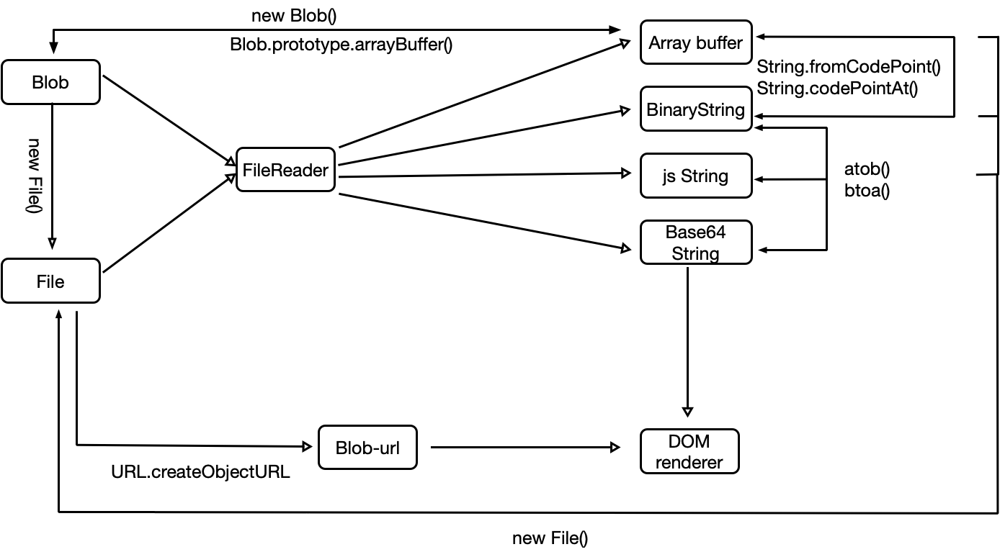

# 从解压一个 zip 文件开始 来看浏览器里的数据操作

做视频编辑器的时候，需要从服务端获取一个模板包文件，然后解压这个文件，然后把文件里面的内容显示出来。

### 解压 ZIP 包

首先，每一种文件，其实都有一套自己的「结构规则」， 比如 psd 就是直接根据 psd 文件规范，把数据直接存成二进制文件， office2007+ 的就是根据 ECMA376 规范，把文件存成多个 xml 格式文档，然后再压缩成一个 pptx, docx 等格式的文档。
那么对于 zip, 其实也是有一套自己的算法的 [Zip (file format)](https://en.wikipedia.org/wiki/Zip_(file_format)),
不过真的要实现这个解压算法还是有很大的工作量的，重点是社区有人已经做好了一个，我们也没必要重复造轮子，
直接用就好了 [Stuk/jszip](https://github.com/Stuk/jszip)， 这边直接贴 2 个官方示例。

```js
// 压缩
var zip = new JSZip();

zip.file("Hello.txt", "Hello World\n");

var img = zip.folder("images");

img.file("smile.gif", imgData, {base64: true});

zip.generateAsync({type:"blob"})

    .then(function(content) {
        // see FileSaver.js
        saveAs(content, "example.zip");
    });

```


```js
// 解压
var zip = new JSZip();

zip.loadAsync(zipDataFromXHR);

require("fs").readFile("hello.zip", function (err, data) {
  if (err) throw err;
  var zip = new JSZip();
  zip.loadAsync(data)
      .then(function (zip) {
          console.log(zip.files);
      });
}
```


解压后，就可以拿到文件列表了，不过还不是我们正常在客户端解压的那种「文件」，还是只是在内存里面的「文件」

zip.files 是一个 file 列表, 调用 file.async() 方法，可以把文件转成对应的格式，以下是 async 的参数:

1. base64 : the result will be a string, the binary in a base64 form.
1. text (or string): the result will be an unicode string.
1. binarystring: the result will be a string in “binary” form, using 1 byte per char (2 bytes).
1. array: the result will be an Array of bytes (numbers between 0 and 255).
1. uint8array : the result will be a Uint8Array. This requires a compatible browser.
1. arraybuffer : the result will be a ArrayBuffer. This requires a compatible browser.
1. blob : the result will be a Blob. This requires a compatible browser.
1. nodebuffer : the result will be a nodejs Buffer. This requires nodejs.

如果只是普通的文本或者图片的话，这个时候就可以直接转成 text 或者 base64 使用了

### blob 对象


上面的 `jszip` 解出来的文件里面，有个格式是 `blob` , 我们先开看看 MDN 上关于 blob 的描述

> Blob 对象表示一个不可变、原始数据的类文件对象。Blob 表示的不一定是JavaScript原生格式的数据。File 接口基于Blob，继承了 blob 的功能并将其扩展使其支持用户系统上的文件。

那么拿到这个 blob 有什么作用呢？

1. 转 File 对象

```js
const file = new File(\[blob\], fileName, options);

// file
```

2. 转 blob-url

```js
const url = URL.crateObjectURL(blob);  // 'blob:httpx://xxxx.xxxx.xxxxxxxxxxxxxxxx'

img.src = url;


// 
```

3. 转 arrayBuffer

```js
blob.arrayBuffer().then(console.log);
// 输出一个 arrayBuffer 对象
```


4. 用 FileReader 读取

```js
const fr = new FileReader();

fr.onload = e => {
     const result = e.target.result;
     // 输出 base64
};

fr.readAsDataURL(blob);
```


FileReader.readAsArrayBuffer()
FileReader.readAsBinaryString()
FileReader.readAsDataURL()
FileReader.readAsText()


以上 4 个方法，从函数名可以很容易看出最终读出的内容格式，这里就不作赘述。

顺便提一句，这里的 4 种格式，刚好可以跟 jszip 解压出来的格式对应上。


### Arraybuffer, 类型数组对象, DataView

> ArrayBuffer 对象用来表示通用的、固定长度的原始二进制数据缓冲区.ArrayBuffer 不能直接操作,而是要通过类型数组对象或 DataView 对象来操作,它们会将缓冲区中的数据表示为特定的格式,并通过这些格式来读写缓冲区的内容.

Arraybuffer 有个同名构造函数,用于创建一个指定长度的,内容全部为 0 的 ArrayBuffer 对象,构造函数接收一个参数,用来指定要创建的内容长度.如：


```javascript
const ab = new ArrayBuffer(8);
// 创建一个 8 字节的 ArrayBuffer
```

由于无法对 Arraybuffer 直接进行操作,所以我们需要借助其他对象来操作. 所有就有了 TypedArray(类型数组对象)和 DataView.

1. TypedArray, TypedArray 是一类对象的统称,事实上 JS 里面并没有一个叫 TypedArray 的对象或构造函数.所以你不能直接使用 TypedArray.以下是 9 个 TypedArray 对象/构造函数

```javascript
Int8Array();
Uint8Array();
Uint8ClampedArray();
Int16Array();
Uint16Array();
Int32Array();
Uint32Array();
Float32Array();
Float64Array();
```
具体用法请参考 [MDN: TypedArray](https://developer.mozilla.org/zh-CN/docs/Web/JavaScript/Reference/Global_Objects/TypedArray)

TypedArray 虽然不是真的数组,但是有几乎跟数组一样的 API,我们可以像操作数组一样操作 TypedArray ,所以有了 TypedArray 我们就可以把 ArrayBuffer 转换成 TypedArray,然后在进行读写操作,达到操作二进制的目的,下面是个例子

```javascript

    const arrayBuffer = new ArrayBuffer(8);

    console.log(arrayBuffer[0]);  // undefined

    const uint8Array = new Uint8Array(arrayBuffer);

    console.log(uint8Array);  // [0, 0, 0, 0, 0, 0, 0, 0]

    uint8Array[0] = 1;
    console.log(uint8Array[0]); // 1

    console.log(uint8Array);  // [1, 0, 0, 0, 0, 0, 0, 0]

```

可以看出,用 `arrayBuffer[0]` 的方式直接获取 ArrayBuffer 对象的内容是获取不到的,而 TypedArray 可以.

> 直接 console.log(arrayBuffer) 在控制台是可以看到 `[[Int8Array]] [[Int16Array]] [[Int32Array]] [[Uint8Array]]` 4 种 TypedArray 数据,不过这应该是浏览器为了方便开发者观察数据,而做的转换,而不是 ArrayBuffer 真的拥有这些数据,毕竟对象名称看起来也不是那么正式(用 `[[]]` 包含)

> 用 `arrayBuffer[0] = 1` 给 ArrayBuffer 对象的某个下标赋值是不会报错的,而且稍后你可以用同样的路径取出该值 `console.log(arrayBuffer[0]) // 1`, 但这并不代表你操作了 ArrayBuffer 的数据,道理跟 `给数组设置属性` 相同.


2. DataView, DataView 提供了跟 TypedArray 类似的功能,与 TypedArray 不同的是 DataView 是一个真实存在的对象,通过提供各种方法来操作不通类型的数据,直接看栗子吧.

```javascript
let arrayBuffer = new ArrayBuffer(8);

    const dataView = new DataView(arrayBuffer);

    console.log(dataView.getUint8(1)); // 0

    dataView.setUint8(1, 2);
    console.log(dataView.getUint8(1)); // 2
    console.log(dataView.getUint16(1)); // 512

    dataView.setUint16(1, 255);
    console.log(dataView.getUint16(1)); // 255
    console.log(dataView.getUint8(1)); // 0

```


就像你看到的,我们可以在同一个数据上面,调用不同的方法,读取/写入 不同类型(长度)的数据,但是大部分情况下,这么做会很难得到我们预期的效果.就像上面的输出,看起来好像不是那么的正常,这是因为 一个 16 位的二进制,用 8 位的格式来读,刚好可以读成 2 个 8 位的二进制.举个栗子

```javascript

// 16 位的 1

0000 0000 0000 0001

// 用 8 位的读就变成

0000 0000  // 0

0000 0001  // 1

```

因为前面 8 位刚好都是 0 , 所以结果看起来除了多个 0 似乎没啥区别？ 当数字比较大的时候

```javascript

// 应该是256？ 我也不太会算这个

0000 0001 0000 0001

// 用 8 位的读就变成

0000 0001  // 1

0000 0001  // 1

```

扯远了,我们回头看看 DataView 提供了哪些方法

```
// 读
DataView.prototype.getInt8()
DataView.prototype.getUint8()
DataView.prototype.getInt16()
DataView.prototype.getUint16()
DataView.prototype.getInt32()
DataView.prototype.getUint32()
DataView.prototype.getFloat32()
DataView.prototype.getFloat64()

// 写
DataView.prototype.setInt8()
DataView.prototype.setUint8()
DataView.prototype.setInt16()
DataView.prototype.setUint16()
DataView.prototype.setInt32()
DataView.prototype.setUint32()
DataView.prototype.setFloat32()
DataView.prototype.setFloat64()
```

> 跟 TypedArray 比 少了一个 Uint8ClampedArray() 具体看 [MDN: DataView](https://developer.mozilla.org/zh-CN/docs/Web/JavaScript/Reference/Global_Objects/DataView)

说了那么多，看到的好像都是读写，那拿到这个「数组」到底有什么用呢？

1. canvan 的 ImageData 就可以直接接收 Uint8ClampedArray 类型的数据。

2. new Blob(arrayBuffer);

3. new File([arrayBuffer], filename, options);


### base64

这个大家都不陌生，说到 base64, 我的第一反应是赋值给 img.src. 但是这个 base64 怎么来的？ 又能转换成哪些格式？

#### 来源
1. FileReader.readAdDataURL()

2. canvas.toDataURL();

3. window.btoa();

4. 其他更古老的 base64 算法;

#### 去向

1. window.atob();

2. 赋值给 DOM 元素;

3. 其他更古老的 base64 算法;


### File 对象

除了上面提到 `blob 对象` 和 `ArrayBuffer` 可以转换成对象，其实字符串和 binaryString 也可以转换成 File 对象。

```js
const file = new File(["aaa"], '1111.txt', {type: 'plain/text'});

// File
```


这样构造出来的 File 对象，和调用 DOM 的 `<input type="file" />` 去本地选取的文件, 是一样的, 可以直接当作一个文件，上传给服务端或者做其他用途。
由于 File 是继承自 Blob 对象的，所以也可以调用 URL.createObjectURL() 转换成一个 blob-url 直接赋值给 DOM 元素。


### 图像转换
前端开发几乎是离不开图片的，尤其是我们弄各种编辑器的，难免要跟图片打交道，很多时候，需要对图片进行进一步的处理。

要对图片进行像素上的转换，可能首选的是把图片画到 canvas 上，然后再进行进一步的处理，那么首先我们来看看 canvas 除了可以画  `` 标签这样的 DOM 以外，还能画哪些元素？

以下是能作为 `canvas.drawImage()` 第一个参数的对象(CanvasImageSource)
 1. CSSImageValue
 1. HTMLImageElement
 1. SVGImageElement
 1. HTMLVideoElement
 1. HTMLCanvasElement
 1. ImageBitmap
 1. OffscreenCanvas

我们可以通过 canvas.context.globalCompositeOperation 来设置混合模式，对图片做一些简单的处理。

1. source-over
1. source-in
1. source-out
1. source-atop
1. destination-over
1. destination-in
1. destination-out
1. destination-atop
1. lighter
1. copy
1. xor
1. multiply
1. screen
1. overlay
1. darken
1. lighten
1. color-dodge
1. color-burn
1. hard-light
1. soft-light
1. difference
1. exclusion
1. hue
1. saturation
1. color
1. luminosity


具体的混合效果可以看 MDN 上的 [globalCompositeOperation](https://developer.mozilla.org/en-US/docs/Web/API/CanvasRenderingContext2D/globalCompositeOperation)

当然，对于复杂的情况，可能以上这些混合模式还没办法满足你(产品)要求, 这时候可能就需要你自己去操作像素数据了。

canvas 提供了一系列操作 ImageData 的接口，允许你自己定义算法，去操作像素数据，这边给一个我在计算 web 视频模板的遮罩视频效果的时候，用到的代码

```js
    const imageData = maskCtx.getImageData(0, 0, width, height);
    const data = imageData.data;
    const len = data.length;

    for(let i = 0; i < len; i += 4) {
        data[i + 3] = 255 - (data[i] + data[i + 1] + data[i + 2]) / 3;
    }

    maskCtx.putImageData(imageData, 0, 0);
```

这里先是从 canvas 取出 ImageData, 取到的就是像素数据，然后遍历像素数据，做了个简单的计算(把彩色照片变黑白)，再放回 canvas, 达到修改图片的目的。

这个 ImageData 其实不一定要从 canvas 里面去 getImageData 才能得到，还可以通过 ImageData 构造函数自行构造一个

```js
const canvas = document.getElementById('canvas');
const ctx = canvas.getContext('2d');
const arr = new Uint8ClampedArray(40000);

// Iterate through every pixel
for (let i = 0; i < arr.length; i += 4) {
  arr[i + 0] = 0;    // R value
  arr[i + 1] = 190;  // G value
  arr[i + 2] = 0;    // B value
  arr[i + 3] = 255;  // A value
}

// Initialize a new ImageData object
let imageData = new ImageData(arr, 200);

// Draw image data to the canvas
ctx.putImageData(imageData, 20, 20);

```

还记得上面说到 TypedArray 的时候，有提到 canvan 的 ImageData 就可以直接接收 Uint8ClampedArray 类型的数据吗？

我试了下，上面通过 FileReader.readAsArrayBuffer 然后再转 Uint8ClampedArray 的数据，
是无法通过调用 ImageData 构造函数，得到正确的图像结果的，猜测原因是 ImageData 需要的是确切的像素数据，
而 FileReader.readAsArrayBuffer 读取的是经过压缩算法的二进制文件，需要经过对应的解码，才能得到像素数据。


图像导出

处理完图片以后，我们最终的目的当然是使用这个图片，除了直接在 canvas 画布上显示外, canvas 还支持导出图片。

导出成 base64

```js
const base64URL = canvas.toDataURL();
```
导出 blob
```js
canvas.toBlob(blob => {
    console.log(blob);
});
```

toBlob 方法接收 3 个参数, 第一个是回调, 必传, 后面两个是可选参数, 第二个是 类型, 第三个是 图片质量(仅对 jpg 格式有效)

如:
```js
canvas.toBlob(blob => {...}, "image/jpeg", 0.95);
```

### 视频处理。

上面提到的 canvas.drawImage() 可以绘制的对象里面，有一个是 `HTMLVideoElement`, 这个其实就是我们 `<video>` 元素。

```js
const video = document.querySelector('#video');
ctx.drawImage(video, 0, 0);
```

我们知道，视频实际上是有很多很多的图片组合起来的，那么 canvas.drawImage 要画视频的哪个画面呢？
可以简单理解为 canvas 画出来的画面，就是视频当前时间播放出来的画面。

把视频画在 canvas 有什么用呢？
1. 对视频截图
2. 「处理」视频的播放效果
3. 图片压缩

> 需要注意的是目前主流浏览器，支持的格式只有 mp4, webm, ogg 另外两个感觉离普及还很久远，
所以可以说常见视频格式里 video 仅支持 H264 编码的 mp4 格式的视频。


### 最后附上一张我梳理的关系图


