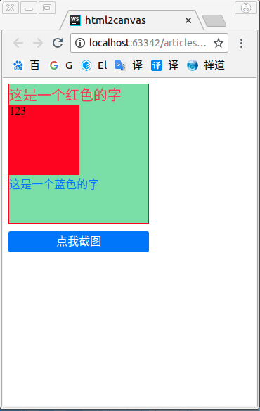

### 前言
昨天写了[新手引导动画的4种实现方式](https://github.com/noahlam/articles/blob/master/%E6%96%B0%E6%89%8B%E5%BC%95%E5%AF%BC%E5%8A%A8%E7%94%BB%E7%9A%844%E7%A7%8D%E5%AE%9E%E7%8E%B0%E6%96%B9%E5%BC%8F.md),
里面用到了 `html2canvas` 于是就顺便了解了一下实现思路.

大概就是 利用 `svg` 的 `foreignObject` 标签, 嵌入 dom, 最后再利用 canvas 绘制 svg. 从而实现最终目的.

先让大家看看效果



**MDN示例**

```JavaScript
var canvas = document.getElementById('canvas');
var ctx = canvas.getContext('2d');

var data = '<svg xmlns="http://www.w3.org/2000/svg" width="200" height="200">' +
           '<foreignObject width="100%" height="100%">' +
           '<div xmlns="http://www.w3.org/1999/xhtml" style="font-size:40px">' +
             '<em>I</em> like' +
             '<span style="color:white; text-shadow:0 0 2px blue;">' +
             'cheese</span>' +
           '</div>' +
           '</foreignObject>' +
           '</svg>';

var DOMURL = window.URL || window.webkitURL || window;

var img = new Image();
var svg = new Blob([data], {type: 'image/svg+xml;charset=utf-8'});
var url = DOMURL.createObjectURL(svg);

img.onload = function () {
  ctx.drawImage(img, 0, 0);
  DOMURL.revokeObjectURL(url);
}

img.src = url;
```

MDN示例其实写的很清楚,不过也相对比较简单一点, dom 是已经构建好的字符串, 其实我觉得整个过程里面最麻烦的就是构建 dom. 所以接下来,我们就来看看具体怎么实现吧


### 第一步 遍历目标节点的所有子元素,并构建对应的字符串

```JavaScript
/**
 * 递归遍历所有子节点
 * @param element Document Element 要计算的元素
 * @param isTop Boolean 是否是最外层元素
**/
function renderDom (element, isTop) {
	let tag = element.tagName.toLowerCase()
	let str = `<${tag} `
    // 最外层的节点,需要加 xmlns 命名空间
	isTop && (str += `xmlns="http://www.w3.org/1999/xhtml" `)
	str += ` style="${getElementStyles(element)}">\n`

	if (element.children.length) {
	    // 递归子元素
		for (let el of element.children) {
			str += renderDom(el)
		}
	} else {
		str += element.innerHTML
	}
	str += `</${tag}>\n`
	return str
}
```

> 这里只做了一个最简单的处理,由于是简单实现,很多特殊情况没考虑进去(如:单标签, img等),有兴趣的童鞋可以自己尝试实现看看.

> 最外层的元素, 需要加命名空间,否则无法识别

这里用到的 `getElementStyles` 就是获取元素的最终渲染样式,下一步会实现.

### 第二步, 获取元素的最终渲染样式,并拼接成行内样式

正常的 dom 元素, 是无法直接放在 `foreignObject` 里面准确地渲染的, 因为还要涉及到父子元素直接的属性继承, 元素默认属性, 非行内样式无法渲染等问题.
所以我们要获取每个元素的**最终渲染样式**, 然后拼接成行内样式.

如何获取元素的最终渲染样式呢? 刚好,浏览器有提供一个 `window.getComputedStyle()` 方法可以做到.


```JavaScript
// 计算每个 dom 的样式
// 这里本来应该直接用 Object.keys + forEach 遍历取出的
// 但是不知道为什么,遍历取出的,会渲染不出来,应该是某些属性有问题
// 暂时没空去排查那些有问题,所以目前先把常用的直接写死.
function getElementStyles (el) {
	let css = window.getComputedStyle(el)
	let style = ''
	// 尺寸相关
	style += `width:${css.width};`
	style += `height: ${css.height};`
	style += `line-height: ${css.lineHeight};`
	style += `max-height: ${css.maxHeight};`
	style += `min-height: ${css.minHeight};`
	style += `max-width: ${css.maxWidth};`
	style += `min-width: ${css.minWidth};`

	style += `font-size: ${css.fontSize};`
	// 颜色相关
	style += `color: ${css.color};`
	style += `background: ${css.background};`
	// 边框相关
	style += `border: ${css.border};`
	style += `box-sizing: ${css.boxSizing};`
	// 位置相关
	style += `margin: ${css.margin};`
	style += `padding: ${css.padding};`
	style += `position: ${css.position};`
	style += `left: ${css.left};`
	style += `right: ${css.right};`
	style += `top: ${css.top};`
	style += `bottom: ${css.bottom};`
	// 布局相关
	style += `display: ${css.display};`
	style += `flex: ${css.flex};`
	return style
}
```

### 第三步, 渲染 svg

把拼接好的 svg 字符串用 `Blob 对象` new 出来(Blob真的是个很强大的对象啊), 然后用 `DOMURL.createObjectURL()` 转换为 url,
有了url, 接下来就看大家自由发挥了. 可以直接下载,也可以在 canvas 里绘制. 或者当作图片直接插入到文档...

```JavaScript

// 主入口函数
function shotScreen () {
    let target = document.querySelector('.content')
    let data = getSvgDomString(target)

    let DOMURL = window.URL || window.webkitURL || window;

    let img = new Image();
    let svg = new Blob([data], {type: 'image/svg+xml;charset=utf-8'});
    let url = DOMURL.createObjectURL(svg);

    img.src = url;
    document.body.appendChild(img)
}

// 计算 svg 的字符串
function getSvgDomString (element) {
	return `
    <svg xmlns="http://www.w3.org/2000/svg" width="200" height="200">\n
       <foreignObject width="100%" height="100%">\n
          ${renderDom(element, 1)}
       </foreignObject>\n
   </svg>`
}

```

这里顺便给个绘制到 canvas 里的代码

```JavaScript
//  如果想画到 canvas 里面
let canvas = document.getElementById('canvas');
let ctx = canvas.getContext('2d');
let img = new Image();

img.onload = function () {
   ctx.drawImage(img, 0, 0);
   DOMURL.revokeObjectURL(url);
}
```


### 最后

参考文档:

[MDN: 将 DOM 对象绘制到 canvas 中](https://developer.mozilla.org/zh-CN/docs/Web/API/Canvas_API/Drawing_DOM_objects_into_a_canvas)

[MDN: foreignObject](https://developer.mozilla.org/zh-CN/docs/Web/SVG/Element/foreignObject)

完整的代码在[这里](https://github.com/noahlam/practice-truth/tree/master/html2canvas),可以直接运行看效果.

本文地址在->[个人技术帖合集](https://github.com/noahlam/articles), 欢迎给个 start 或 follow
